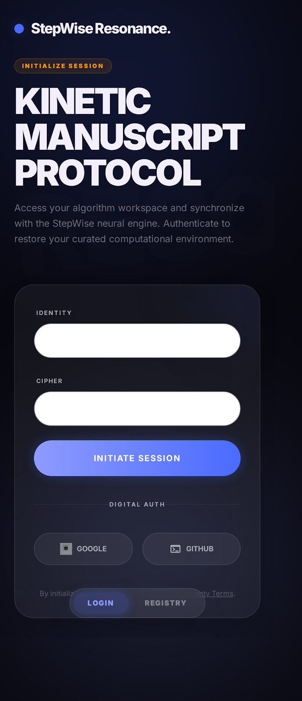
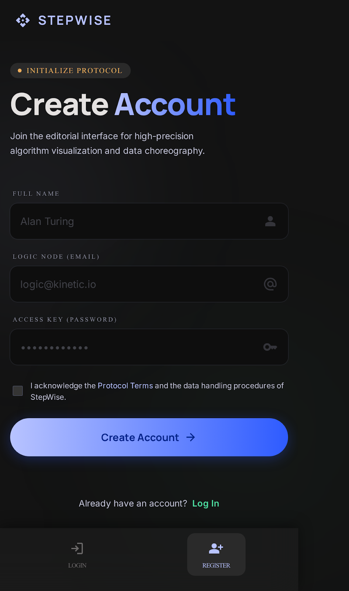
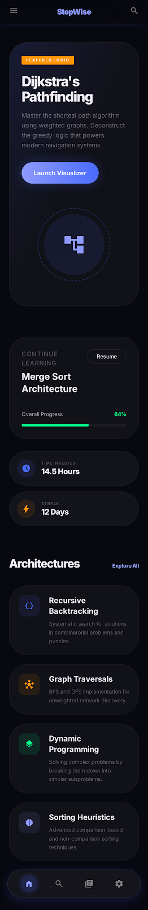

# StepWise

**A Kinetic Manuscript Protocol for High-Precision Algorithm Visualization.**

StepWise is a cross-platform mobile and desktop application built with Flutter. It serves as an interactive educational engine that renders complex data structures and algorithmic logic into fluid, traversable visual states.

Instead of just running an algorithm, StepWise allows users to step through the execution frame-by-frame, mapping visual data transformations directly to pseudo-code.

---

## Current Implementation (Iteration 1)

This repository currently contains the **Core UI Architecture and Authentication Gateway** for the StepWise platform.

### Features
* **Secure Authentication Gateway:** Full Login and Registration flow, deeply integrated with Firebase Authentication.
* **Kinetic Manuscript Dashboard:** A dynamic home screen tracking user progress, logic mastery, and providing access to the algorithm catalog.
* **Custom Design System:** Built from the ground up with a custom dark theme, neon-accented UI components, and reusable widget architecture (Clean Architecture).
* **Cross-Platform Ready:** Configured to compile seamlessly on Android, iOS, Web, and Linux Desktop.

---

## Interface Showcases

| Authentication Gateway | Protocol Initialization | The Kinetic Manuscript |
| :---: | :---: | :---: |
|  |  |  |

---

## Prerequisites & Setup

To run this project locally, ensure you have the following installed:
* [Flutter SDK](https://docs.flutter.dev/get-started/install) (Version 3.19.0 or higher)
* [Dart SDK](https://dart.dev/get-dart)
* [Firebase CLI](https://firebase.google.com/docs/cli) (For connecting to your own Firebase instance)

### 1. Clone the Repository
```bash
git clone [https://github.com/your-username/stepwise.git](https://github.com/your-username/stepwise.git)
cd stepwise/frontend
```

### 2. Install Dependencies
```bash
flutter pub get
```

### 3. Firebase Configuration (Important)
For security reasons, the `lib/firebase_options.dart` file containing API keys is excluded from version control. To connect the app to your own database:
1. Create a new project in the [Firebase Console](https://console.firebase.google.com/).
2. Run the FlutterFire CLI in the root directory:
   ```bash
   flutterfire configure
   ```
3. Select your platforms and allow the CLI to generate your local `firebase_options.dart`.

---

## How to Run

Flutter allows you to run this application across multiple platforms. Use the terminal commands below based on your target device.

**For Linux Desktop (Native Performance):**
```bash
flutter run -d linux
```

**For Web Browser (Chrome):**
```bash
flutter run -d chrome
```

**For Android (Requires an active emulator or connected device):**
```bash
flutter run -d android
```

**For iOS (Requires macOS and Xcode):**
```bash
flutter run -d ios
```

---

## Repository Architecture

Following a modular approach, the `frontend/lib/` directory is structured as follows:
* `/presentation`: Contains the UI screens, broken down by feature (`/auth`, `/home`).
* `/presentation/widgets`: Highly reusable, theme-specific UI components (e.g., `CustomTextField`, `PrimaryButton`).
* `/docs`: Contains Iteration documentation and design prototypes.
* `/database`: Contains the `schema.sql` outlining the eventual NoSQL structure.
* `/backend`: Placeholder for future Node.js/Python microservices.
